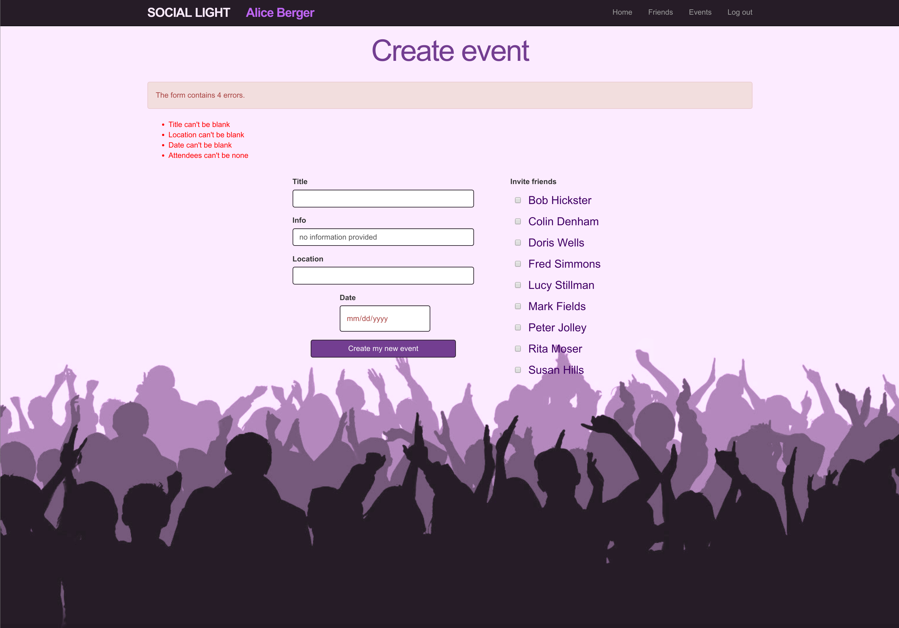
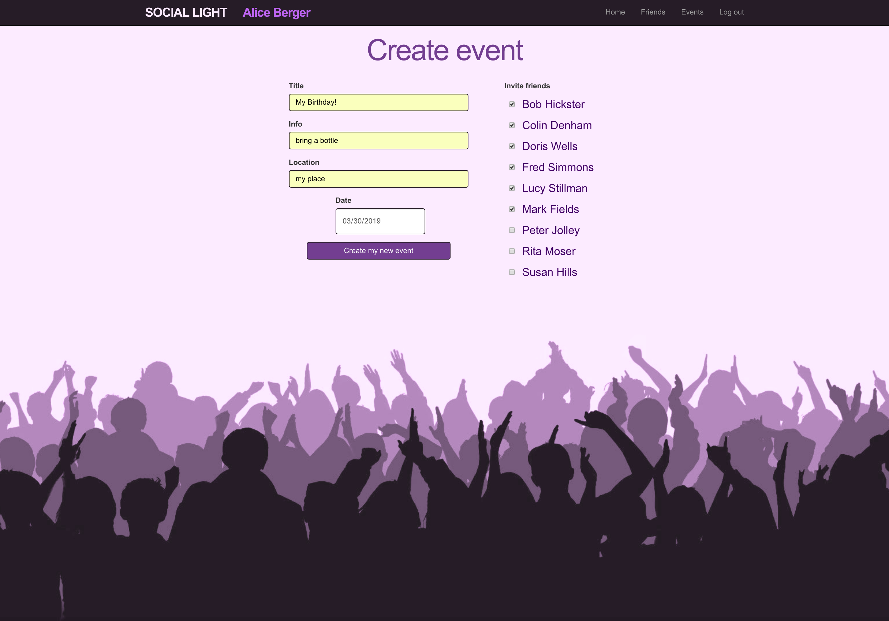
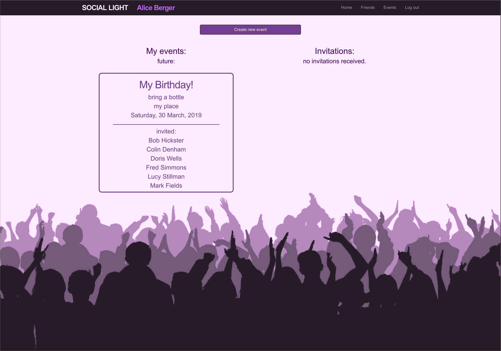
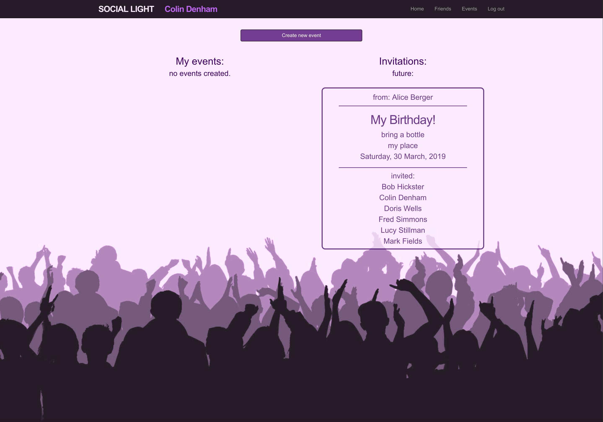
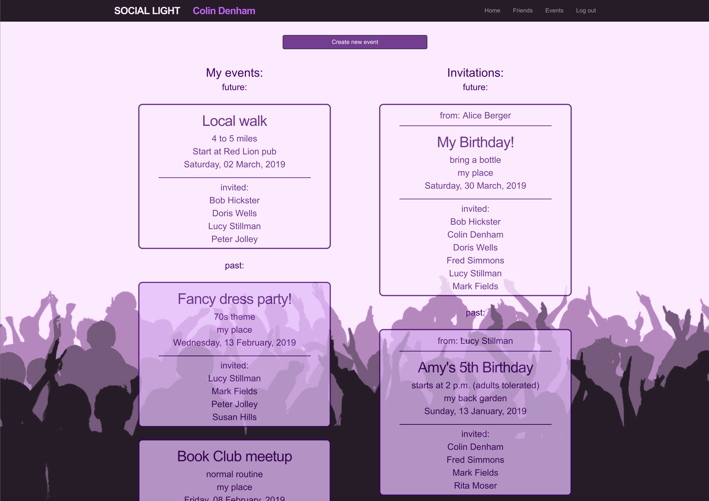

# Social Light

Simon Tharby's solution to [Project 2: Private Events](https://www.theodinproject.com/courses/ruby-on-rails/lessons/associations), Associations section, Ruby on Rails unit, Odin Project.

[View in browser](https://social-light-simontharby.herokuapp.com/)

## Instructions:

"... build a site similar to a private [Eventbrite](https://www.eventbrite.com/) which allows users to create events and then manage user signups. Users can create events and send invitations [to] parties (sound familiar?). Events take place at a specific date and at a location (which you can just store as a string, like “Andy’s House”).

A user can create events. A user can attend many events. An event can be attended by many users. This will require you to model many-to-many relationships and also to be very conscious about your foreign keys and class names (hint: you won’t be able to just rely on Rails’ defaults like you have before)."

Note: I chose not to implement an events index page (as instructed), as I completed the 'extra credit' section, implementing filters for the user show page so that a user only sees events he/she created or is invited to, and an index of all events seemed to run counter to this idea.

## Not a complete application:

Since the focus of this exercise is practice in creating a through-table (Attendances) and the appropriate creation / usage of related Active Record associations (User <=> Attendance(s) <=> Event), certain actions are not implemented (User: update / delete, Event: update / delete / index, Attendance: all actions, except indirectly; show).

The focus is on demonstrating the ability to create events which include a list of attendees (invited users), and the filtering of such events by date (future vs. past) when shown on the User page (named: 'events').

To facilitate this demonstration, no real security of access is provided. Anyone can log in as any user, without need for a password, so that the full effects of event creation can be investigated from the perspective of various users (creator of event vs. invited to event vs. neither a creator of, nor invited to an event). In a similar vein, events for dates in the past can be created, so that the difference in presentation of past events vs. future events can be observed.

Obviously, were this developed into a full application, all of the above issues would need addressing.

## Screenshots:

### Event creation form:

Example of submission of invalid form contents:



Example of submission of valid form contents:



### User show page (named 'events' as shows events related to user):

The event created by the valid form submission (above) is shown for this user (as creator):



The event created by the valid form submission (above) is shown for this user (as invited guest):



Future and past events are discriminated clearly using different background colors:



## Getting started

To get started with the app, clone the repo and then install the needed gems:

```
$ bundle install --without production
```

Next, migrate the database:

```
$ rails db:migrate
```

Finally, run the test suite to verify that everything is working correctly:

```
$ rails test
```

If the test suite passes, you'll be ready to run the app in a local server:

```
$ rails server
```

Note: To manually delete attendances related to an event, using rails console:

```
$ event_attendances = Attendance.where(:event_id => <event_id_as_integer>)
$ event_attendances.delete_all
```
